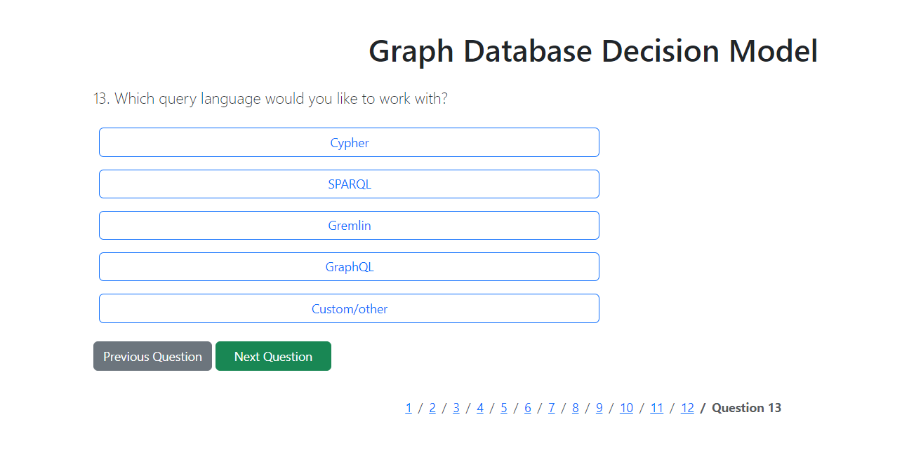
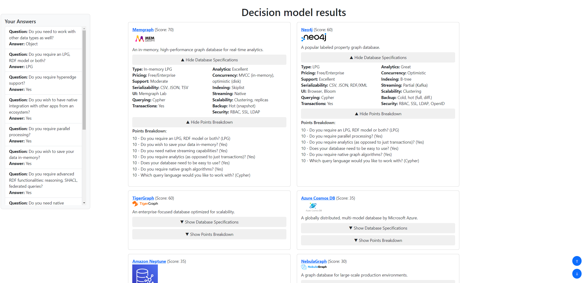

# Decision model for selecting a graph database

Install necessary libraries and run decision model.
```
npm install
node app.js
```
The decision model is served at localhost:3000.

</img>

It consists of a set of questions based on which databases are scored.
After answering all questions the result page is shown, with the best-fitting databases shown first.


</img>

<hr>
Copyright:

amazon-neptune.png - Amazon, https://gallery.ecr.aws/neptune/

anzograph.png - dbdb.io, https://dbdb.io/db/anzograph/

arangodb.png - DevOpsSchool, https://www.devopsschool.com/blog/wp-content/uploads/2022/03/arangodb-01.png

azure-cosmos-db.png - Zimetrics, https://zimetrics.com/logo-platforms-and-t/azure-cosmos-db/

datastax.png - dbdb.io, https://dbdb.io/db/datastax/

dgraph.png - dbdb.io, https://dbdb.io/db/dgraph/

graphdb.png - dbdb.io, https://dbdb.io/db/graphdb/revisions/13

hypergraphdb.png - dbdb.io, https://dbdb.io/db/hypergraphdb/

janusgraph.png - dbdb.io, https://dbdb.io/db/janusgraph/

memgraph.png - dbdb.io, https://dbdb.io/db/memgraph/

nebulagraph.png - dbdb.io, https://dbdb.io/db/nebulagraph/

neo4j.png - Wikimedia, https://commons.wikimedia.org/wiki/File:Neo4j-logo_color.png

orientdb.png - dbdb.io, https://dbdb.io/db/orientdb/

oraclegraph.png - Oracle, https://www.oracle.com/database/technologies/datawarehouse-bigdata.html

stardog.png - Gartner, https://www.gartner.com/reviews/market/cloud-database-management-systems/vendor/stardog/product/stardog

terminusdb.png - dbdb.io, https://dbdb.io/db/terminusdb/

tigergraph.png - TigerGraph, https://www.tigergraph.com/

